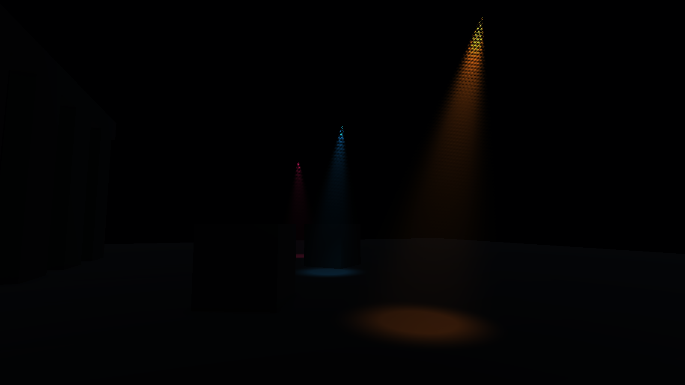
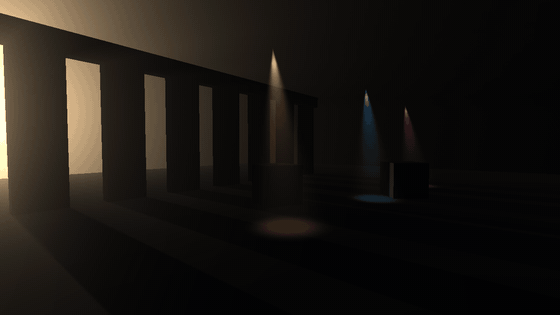
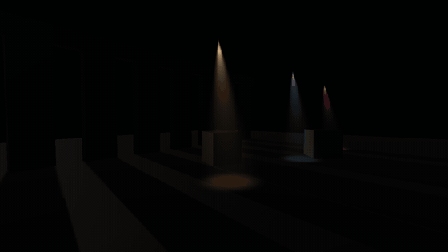

# Volumetric Lighting

Raymarched volumetric scattering for the Universal Render Pipeline. Real god
rays through the main directional light's shadow cascades, plus opt-in
scattering from spot lights. One renderer feature, one Volume override, no
per-object setup — drop it in and your existing lights start casting light
through the air.

  
  

The demo scene (`Samples/Demo.unity`) at 1600×900, Full resolution,
no blur. Right: the same scene with the sun turned off — only the three
`VolumetricSpotLight` cones remain.

## In motion

  
  

Left: the sun rotating. The shafts are read from the cascade shadow map
every frame, so they sweep with it — nothing is baked. Right: the same frame
with `Intensity` ramped from `0` to `1`; at `0` the sun march is skipped
entirely and only the three spot cones are left.

## Same frame, effect off / on

  
  

Nothing changes but the `Enabled` checkbox on the Volumetric Lighting
override. Geometry, materials and light setup are identical.

## Requirements

- Unity **6000.0.61f1** (Unity 6.0 LTS) or later — the version this was
  developed and tested on.
- Universal Render Pipeline **17+**, using **Render Graph** (the default in
  Unity 6). The pass is written against the Render Graph API only.

## Install

Grab the `.unitypackage` from
[Releases](https://github.com/ValtielChan/VolumetricLighting/releases), or copy
the `Volumetric Lighting` folder into your project's `Assets/`. That's the whole
asset — two assembly definitions, one shader, no dependencies beyond URP
itself.

## Setup

1. Open your **URP Renderer** asset (`Assets/Settings/*_Renderer.asset` in a
   default project) and `Add Renderer Feature → Volumetric Lighting Feature`.
2. Add a **Volume** to your scene (or reuse an existing one) and
   `Add Override → Lighting → Volumetric Lighting`.
3. Tick **Enabled** on the override, and raise **Density** until you see it.
4. Optional: add `Add Component → Rendering → Volumetric Spot Light` to each
   spot light that should scatter.

`Samples/Demo.unity` is steps 2–4 already done; you still need step 1, since
renderer features live on the render pipeline asset rather than in the scene.

## Volume parameters

| Parameter | What it does |
|---|---|
| `Enabled` | Master switch. Off = the pass is never enqueued, zero cost. |
| `Intensity` | Scattering multiplier for the **main directional light**. `0` skips the sun path (and its shadow sample) entirely — set it to 0 at night. |
| `Steps` | Samples per pixel for the **sun** march, and the budget the spot integration scales itself from. **16–24** mobile, **32–48** desktop, more only if the sun shafts still grain. |
| `Max Distance` | How far the ray marches, in meters, and how far the fog reaches. It coarsens the **sun** march when you push it out; the spot cones are unaffected. |
| `Scattering` | Henyey-Greenstein anisotropy. Positive = forward scattering, the classic bright halo around the sun. |
| `Density` | Scattering coefficient of the medium — "how much fog". |
| `Tint` | HDR tint applied to every contribution. |
| `Spots Enabled` / `Spot Intensity` | Enable and globally scale the spot light contribution. |
| `Spot Cull Distance` | Spot lights further than this from the camera are skipped on the CPU. `0` = no culling. |

The demo profile (`Samples/VolumetricLightingProfile.asset`) is a reasonable
desktop starting point.

## Renderer feature settings

| Setting | What it does |
|---|---|
| `Injection Point` | When the pass runs. Default `BeforeRenderingTransparents`, so transparents composite over the fog. |
| `Resolution` | Raymarch buffer size: `Full`, `Half`, `Quarter`. **Quarter** is the mobile default, `Full` for stills and desktop. |
| `Blur Iterations` | Optional separable gaussian passes over the volumetric buffer. **0** (default) keeps the shafts crisp. **1–2** trades that crispness against sun-shaft grain when you cannot afford the `Steps` that would remove it properly. |
| `Shader` | Auto-resolved to `Hidden/VolumetricLighting`; leave it empty. |

### Presets that work

| | Resolution | Blur Iterations | Steps | Max Distance |
|---|---|---|---|---|
| **Mobile** | Quarter | 0 | 16–24 | 30–40 m |
| **Balanced** | Half | 0 | 32–48 | 40–60 m |
| **PC / stills** | Full | 0 | 96–128 | 40–50 m |

`Resolution` changes how *coarse* the fog is, never how sharp the frame is:
the composite is depth-aware, so silhouettes stay crisp at Quarter. Pick it on
your frame budget alone. `Max Distance` is a look choice, not a quality one —
push it as far as the scene needs.

## How it works

Recorded on the Render Graph:

1. **Raymarch** into an off-screen `R16G16B16A16_SFloat` target at the chosen
   resolution. The two light types are integrated separately, because they need
   very different things:
   - The **sun** is marched along the whole ray, `Steps` samples with an
     interleaved-gradient-noise jitter. It has to be walked because its
     occlusion comes from the **cascade shadow map, sampled directly** — not
     the screen-space shadow texture, which is meaningless for a point floating
     in mid-air. The loop early-outs once transmittance drops below 1%, and is
     skipped entirely when `Intensity` is 0.
   - Each **spot light** is integrated over its own slice of the ray: the
     ray/cone intersection gives the interval where that light can reach, and
     the samples go there instead of being spread over `Max Distance`. Pixels
     outside every cone cost nothing at all. The medium is homogeneous, so
     transmittance is closed-form and each light can be integrated on its own.
2. **Blur**, `Blur Iterations` times (0 by default, so usually skipped): a
   9-tap gaussian folded into 5 bilinear fetches, horizontal then vertical,
   over the volumetric buffer only.
3. **Composite** into camera colour with hardware additive blending
   (`Blend One One`) — no extra fullscreen copy. The upsample is
   **depth-aware**: the raymarch stores, in the buffer's alpha, the scene
   depth each texel was marched against, and the composite rejects the taps
   that belong to a different surface. That is what keeps a Quarter-resolution
   buffer from smearing a four-pixel halo around every silhouette.

Spot lights are packed CPU-side into three `Vector4` arrays (position +
1/range, forward + cos(outer), colour·intensity + cos(inner)) and culled by
camera distance there; the shader culls again per sample by range and cone
angle. The `_VL_SPOTS_ON` keyword removes the whole spot loop when no spot is
active.

The pass sets `requiresIntermediateTexture`, which forces URP to allocate an
intermediate colour target. Without it URP renders straight to the back
buffer in simple frames and the composite — which reads a texture while
writing camera colour — silently does nothing.

## The dither

Marching a fixed number of steps through a light shaft quantises it into bands.
The sun march offsets each pixel's first sample by a noise pattern to trade
those bands for noise, which is cheaper than the step count it would take to
remove either — so at low `Steps` you will see grain in the sun shafts. That
part is a deliberate trade, and plenty of people like the look.

**Spot cones no longer dither at any setting.** They used to, badly, and the
reason is worth knowing if you extend this: they were sampled along the shared
camera ray, so their sample density was set by `Max Distance`. With the fog
reaching 127 m, a cone a few metres across got two or three samples and the
jitter turned that into a visible pattern — and raising `Steps` barely helped,
because the extra samples went mostly into empty distance. Each spot is now
integrated over the interval where its own cone actually is, so a crossing gets
the same sample count whether the fog reaches 30 m or 300 m.

If you do want to trade sun-shaft grain for softness on a small step budget,
`Blur Iterations` on the renderer feature is one separable gaussian over the
volumetric buffer. It is off by default because it costs shaft crispness, and
because raising `Steps` is usually the better answer. Two things if you turn it
on: widening happens by **repeating** the kernel, not by stretching its taps
(stretching undersamples the kernel and aliases the grain into a coarser
pattern), and the blur is not depth-aware — only the upsample is — so at Half
or Quarter it can pull a little fog past a silhouette.

## Mobile guidance

- Renderer feature resolution → **Quarter**. Edges stay sharp there; only the
  fog itself gets coarser.
- `Steps` 16–24, `Density` 0.1–0.3. `Max Distance` is free to be whatever the
  scene wants; it only affects how far the sun march has to reach.
- Keep 2–4 `VolumetricSpotLight` visible at once.
- Set `Intensity` to 0 whenever the sun is not the story: the whole sun march,
  shadow sampling included, is then skipped and only the spot cones are
  integrated.

## Limits

- **No shadows for spot lights.** Headlights and candles scatter through
  walls; only the main directional light is occluded.
- **No light cookies** on the volumetrics.
- **8 active spot lights** maximum. Raise `VolumetricSpotLight.MaxActive` and
  `VL_MAX_SPOTS` in the shader together if you need more.
- **Point lights are not supported** — directional and spot only.
- **No temporal reprojection.** The jitter is resolved by step count alone
  (or by the optional blur), never across frames, so the dither is stable and
  does not shimmer — but it also never averages itself out for free.
- The optional blur is a plain gaussian; only the upsample knows about depth.

## License

[MIT](LICENSE.md) — free to use, modify and redistribute, including in
commercial projects. Just keep the copyright notice and license text.

© 2026 Fabien Boco
