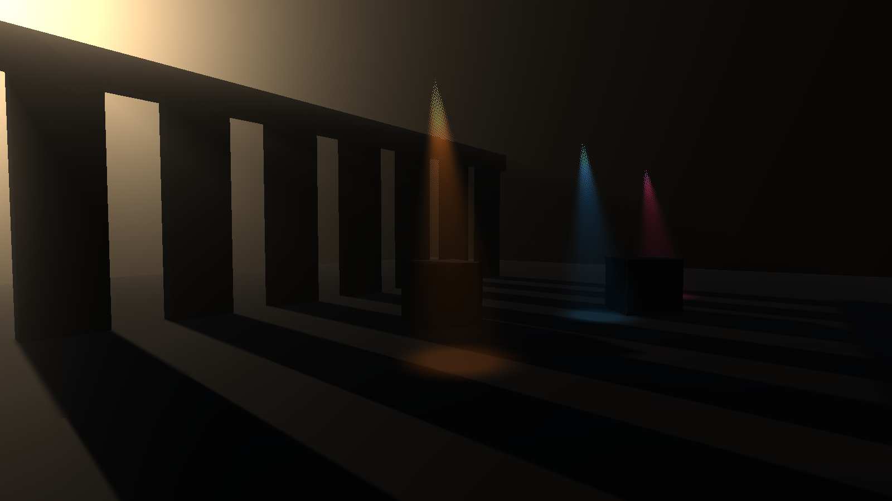
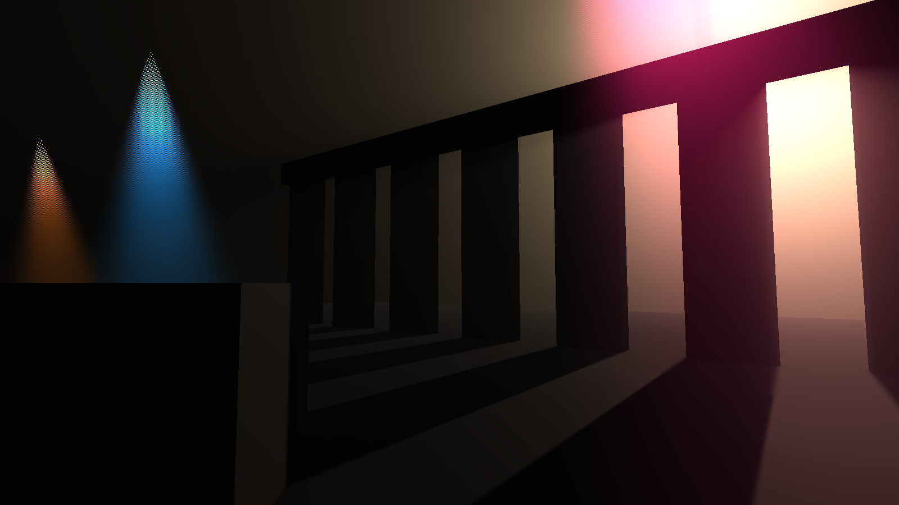
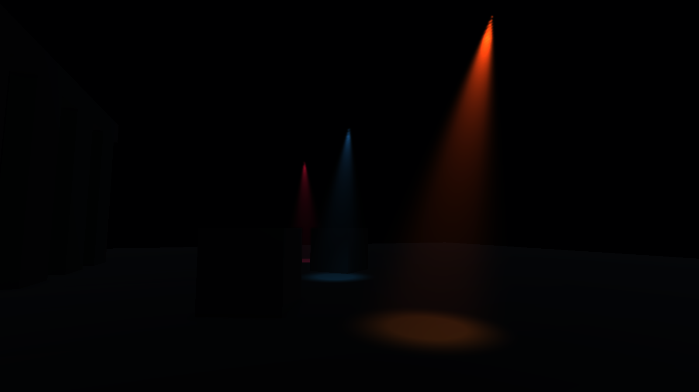
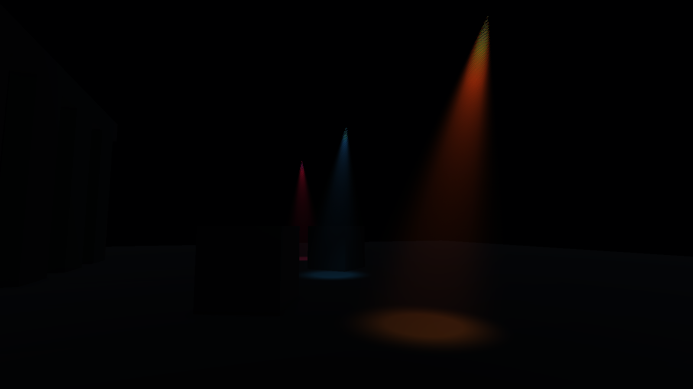
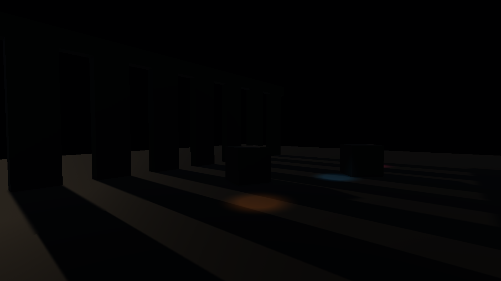

# Volumetric Lighting

Raymarched volumetric scattering for the Universal Render Pipeline. Real god
rays through the main directional light's shadow cascades, plus opt-in
scattering from spot lights. One renderer feature, one Volume override, no
per-object setup — drop it in and your existing lights start casting light
through the air.



<p align="center">
  
  
</p>

<sub>The demo scene (`Samples/Demo.unity`) at 1600×900, Full resolution,
no blur. Right: the same scene with the sun turned off — only the three
`VolumetricSpotLight` cones remain.</sub>

## Blur off / on (optional)

<p align="center">
  
  
</p>

<sub>`Blur Iterations` 0 (the default) and 1. The blur is a trade, not an
upgrade: it buys smooth cones on a small step budget and costs you crisp shaft
edges. Raising `Steps` gets you smooth *and* sharp — see
[The dither](#the-dither).</sub>

## Same frame, effect off / on

<p align="center">
  
  
</p>

<sub>Nothing changes but the `Enabled` checkbox on the Volumetric Lighting
override. Geometry, materials and light setup are identical.</sub>

## Requirements

- Unity **6000.0.61f1** (Unity 6.0 LTS) or later — the version this was
  developed and tested on.
- Universal Render Pipeline **17+**, using **Render Graph** (the default in
  Unity 6). The pass is written against the Render Graph API only.

## Install

Copy the `Volumetric Lighting` folder into your project's `Assets/`. That's
the whole asset — two assembly definitions, one shader, no dependencies
beyond URP itself.

## Setup

1. Open your **URP Renderer** asset (`Assets/Settings/*_Renderer.asset` in a
   default project) and `Add Renderer Feature → Volumetric Lighting Feature`.
2. Add a **Volume** to your scene (or reuse an existing one) and
   `Add Override → Lighting → Volumetric Lighting`.
3. Tick **Enabled** on the override, and raise **Density** until you see it.
4. Optional: add `Add Component → Rendering → Volumetric Spot Light` to each
   spot light that should scatter.

`Samples/Demo.unity` is steps 2–4 already done; you still need step 1, since
renderer features live on the render pipeline asset rather than in the scene.

## Volume parameters

| Parameter | What it does |
|---|---|
| `Enabled` | Master switch. Off = the pass is never enqueued, zero cost. |
| `Intensity` | Scattering multiplier for the **main directional light**. `0` skips the sun path (and its shadow sample) entirely — set it to 0 at night. |
| `Steps` | Raymarch samples per pixel. **16–24** mobile, **32–48** desktop. |
| `Max Distance` | How far the ray marches, in meters. Keep it near the size of what the camera actually sees: a large value spreads the same step count over more distance and coarsens the result. |
| `Scattering` | Henyey-Greenstein anisotropy. Positive = forward scattering, the classic bright halo around the sun. |
| `Density` | Scattering coefficient of the medium — "how much fog". |
| `Tint` | HDR tint applied to every contribution. |
| `Spots Enabled` / `Spot Intensity` | Enable and globally scale the spot light contribution. |
| `Spot Cull Distance` | Spot lights further than this from the camera are skipped on the CPU. `0` = no culling. |

The demo profile (`Samples/VolumetricLightingProfile.asset`) is a reasonable
desktop starting point.

## Renderer feature settings

| Setting | What it does |
|---|---|
| `Injection Point` | When the pass runs. Default `BeforeRenderingTransparents`, so transparents composite over the fog. |
| `Resolution` | Raymarch buffer size: `Full`, `Half`, `Quarter`. **Quarter** is the mobile default, `Full` for stills and desktop. |
| `Blur Iterations` | Optional separable gaussian passes over the volumetric buffer. **0** (default) keeps the shafts crisp. **1–2** trades that crispness for smooth cones when you cannot afford the `Steps` that would do it properly. |
| `Shader` | Auto-resolved to `Hidden/VolumetricLighting`; leave it empty. |

### Presets that work

| | Resolution | Blur Iterations | Steps | Max Distance |
|---|---|---|---|---|
| **Mobile** | Quarter | 0 | 16–24 | 30–40 m |
| **Balanced** | Half | 0 | 32–48 | 40–60 m |
| **PC / stills** | Full | 0 | 96–128 | 40–50 m |

`Resolution` changes how *coarse* the fog is, never how sharp the frame is:
the composite is depth-aware, so silhouettes stay crisp at Quarter. Pick it
on your frame budget alone.

## How it works

Recorded on the Render Graph:

1. **Raymarch** into an off-screen `R16G16B16A16_SFloat` target at the chosen
   resolution. For each pixel the scene depth gives the ray's end point (the
   sky clamps to `Max Distance`), and the ray is marched with an
   interleaved-gradient-noise jitter to break up banding. At each step the
   directional light's **cascade shadow map is sampled directly** — not the
   screen-space shadow texture, which is meaningless for a point floating in
   mid-air — and every registered spot light is accumulated analytically.
   The loop early-outs once transmittance drops below 1%.
2. **Blur**, `Blur Iterations` times (0 by default, so usually skipped): a
   9-tap gaussian folded into 5 bilinear fetches, horizontal then vertical,
   over the volumetric buffer only.
3. **Composite** into camera colour with hardware additive blending
   (`Blend One One`) — no extra fullscreen copy. The upsample is
   **depth-aware**: the raymarch stores, in the buffer's alpha, the scene
   depth each texel was marched against, and the composite rejects the taps
   that belong to a different surface. That is what keeps a Quarter-resolution
   buffer from smearing a four-pixel halo around every silhouette.

Spot lights are packed CPU-side into three `Vector4` arrays (position +
1/range, forward + cos(outer), colour·intensity + cos(inner)) and culled by
camera distance there; the shader culls again per sample by range and cone
angle. The `_VL_SPOTS_ON` keyword removes the whole spot loop when no spot is
active.

The pass sets `requiresIntermediateTexture`, which forces URP to allocate an
intermediate colour target. Without it URP renders straight to the back
buffer in simple frames and the composite — which reads a texture while
writing camera colour — silently does nothing.

## The dither

Marching a fixed number of steps through a light shaft quantises it into
bands. The raymarch offsets each pixel's first sample by a noise pattern to
trade those bands for noise, on the usual assumption that something
downstream resolves it. Nothing does here, so you see the noise — and since
the pattern is interleaved gradient noise it reads as a regular dither rather
than as grain. Plenty of people like it; it is not a bug you have to remove.

It appears **where one step is too coarse for how fast the light changes over
it**, which is why it lands on spot cones and not on broad sun shafts: close
to the bulb, the whole cone profile can be narrower than a single step.

So the number that governs it is the **step length**:

```
step length = Max Distance / Steps
```

Around **1 m** the cones dither. Around **0.35 m** they are smooth, and only
the last metre before each bulb still shows anything. In the demo scene that
is 128 steps over 45 m. Lowering `Max Distance` is usually the cheaper half of
that trade — marching 127 m through a 40 m room spends most of the budget on
nothing.

`Blur Iterations` is the fallback when you cannot afford those steps: one
separable gaussian over the volumetric buffer. It works, and it costs shaft
crispness — which is why it is off by default.

Two things worth knowing if you do turn it on:

- Widening happens by **repeating** the kernel, not by stretching its taps.
  Spreading a 5-tap gaussian over more texels undersamples the kernel itself
  and aliases the dither into a coarser, more visible pattern.
- The blur is not depth-aware (only the upsample is), so at Half or Quarter it
  can pull a little fog past a silhouette.

## Mobile guidance

- Renderer feature resolution → **Quarter**. Edges stay sharp there; only the
  fog itself gets coarser.
- `Steps` 16–24, `Density` 0.1–0.3, `Max Distance` 30–40 m — keep
  `Max Distance` tight, it is what makes low step counts usable.
- Keep 2–4 `VolumetricSpotLight` visible at once.
- Set `Intensity` to 0 whenever the sun is not the story: it removes the
  shadow-map sample from the inner loop, which is the expensive part.

## Limits

- **No shadows for spot lights.** Headlights and candles scatter through
  walls; only the main directional light is occluded.
- **No light cookies** on the volumetrics.
- **8 active spot lights** maximum. Raise `VolumetricSpotLight.MaxActive` and
  `VL_MAX_SPOTS` in the shader together if you need more.
- **Point lights are not supported** — directional and spot only.
- **No temporal reprojection.** The jitter is resolved by step count alone
  (or by the optional blur), never across frames, so the dither is stable and
  does not shimmer — but it also never averages itself out for free.
- The optional blur is a plain gaussian; only the upsample knows about depth.

## License

[MIT](LICENSE.md) — free to use, modify and redistribute, including in
commercial projects. Just keep the copyright notice and license text.

© 2026 Fabien Boco
